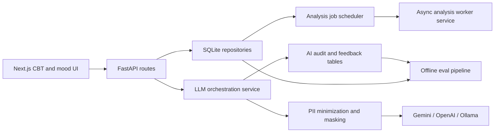

# AI CBT Enhancements Design

Date: 2026-05-03

## Goal

Build a privacy-preserving, testable, provider-agnostic AI layer for CBT journaling that captures model/user feedback for evals, produces more empathetic reframes and action plans, supports offline batch evals, runs longitudinal analysis asynchronously, and improves mobile usability.

## Design Principles

- User agency first: AI suggests, the user accepts, edits, or rejects.
- Sensitive data discipline: raw therapeutic content is application data, not log data.
- Structured contracts: provider output is validated before it reaches persistence or UI.
- Provider agnosticism: FastAPI routes depend on internal interfaces, not Gemini/OpenAI/Ollama SDKs.
- Offline evals: batch evaluation is a separate data-processing surface, not part of the web request path.
- TDD by default: each new behavior starts as a failing automated test.

## Shared Architecture



## Data Contracts

### AI interaction audit

`ai_audit_logs` should represent one model operation, not one final user journal. Proposed canonical fields:

- `id`
- `correlation_id`
- `user_id`
- `entry_type` (`cbt_log`, `mood_entry`, or `standalone_analysis`)
- `entry_id`
- `operation` (`detect_distortions`, `generate_reframes`, `generate_action_plans`, `mood_analysis`, `longitudinal_analysis`)
- `provider`
- `model`
- `prompt_version_id`
- `masked_request_payload`
- `response_payload`
- `safety_ratings`
- `safety_tier`
- `latency_ms`
- `status` (`success`, `safety_blocked`, `timeout`, `provider_error`, `parse_error`)
- `error_code`
- `schema_version`
- `created_at`

### User feedback/event capture

`ai_feedback_events` should capture HITL outcomes. It may contain sensitive therapeutic content because the user asked to collect user-accepted/user-input responses for evals. Treat it as application data with retention/export/delete rules, not as infrastructure logging.

- `id`
- `audit_log_id`
- `user_id`
- `cbt_log_id`
- `accepted_distortions_payload`
- `ignored_distortions_payload`
- `accepted_reframe_payload`
- `ignored_reframes_payload`
- `user_rational_response`
- `accepted_action_plan_payload`
- `user_action_plan`
- `source` (`accepted_ai`, `edited_ai`, `user_original`)
- `created_at`

Review refinement: CBT analysis audit rows must be associated with the authenticated `user_id` before the analysis id is returned to the client. Feedback capture validates by both `audit_log_id` and `user_id`, so missing audit ownership breaks the analyze-then-save feedback join and weakens downstream eval observability.

### CBT analysis response

The response should remain structured and HITL-friendly.

```json
{
  "analysisId": "uuid",
  "suggestions": [
    {
      "id": "suggestion-uuid",
      "distortion": "all-or-nothing thinking",
      "reasoning": "Short, non-judgmental explanation",
      "confidence": 0.74
    }
  ],
  "reframes": [
    {
      "id": "reframe-uuid",
      "perspective": "Compassionate",
      "content": "Warm, validating, non-diagnostic reframe"
    }
  ],
  "actionPlans": [
    {
      "id": "plan-uuid",
      "title": "One small next step",
      "rationale": "Why this may help",
      "steps": ["Concrete step within user control"],
      "timeframe": "today"
    }
  ],
  "provider": "gemini",
  "model": "gemini-1.5-flash",
  "promptVersion": "cbt-reframe-v2"
}
```

## Provider Fallback Design

Use a provider chain parsed from configuration. Example:

```text
AI_CBT_MODEL_CHAIN=gemini:gemini-1.5-flash,openai:gpt-5.5,ollama:llama3.1
```

Routes call `LLMOrchestrator.analyze_cbt(request)`. The orchestrator:

1. Builds a provider-independent prompt and schema request.
2. Applies PII minimization/masking for external providers.
3. Tries providers in configured order.
4. Retries only retryable failures.
5. Stops on safety blocks and returns the existing crisis-resource path.
6. Records one audit row per provider attempt.
7. Returns provider metadata for the successful attempt.

PR review refinements:

- Provider-level timeouts such as `LLMTimeoutError` must map to HTTP 504, matching the user-facing retry semantics already used for request-level timeouts.
- Generic provider failures should log structured debugging metadata such as `error_type` and fully qualified `error_class`, but should not log raw exception text when it may contain prompts, provider payloads, or user-authored journal content.
- Provider clients should not be rebuilt for every CBT analysis request. Long-lived provider stacks may be cached when the provider chain and connection-relevant configuration are unchanged.
- Provider cache keys must refresh when credential material changes. Do not key only on whether an OpenAI key is present; use a safe credential fingerprint or equivalent non-logging comparison so key rotation does not keep stale clients alive.

## Async Analysis Design

Writes must commit first. After a successful mood or CBT insert:

1. The route schedules an analysis job with `BackgroundTasks`.
2. The background service opens its own DB connection.
3. The service creates or updates an analysis result row with `queued`, `running`, `succeeded`, or `failed`.
4. The UI can retrieve current analysis summaries without blocking the original write.

The SQLite implementation should use a focused service boundary that can later be replaced by a queue worker without changing route contracts.

PR review refinements:

- The async mood pipeline must preserve the existing `/moods` contract. Either write the completed mood analysis back to `mood_entries.ai_analysis` or update the mood retrieval path to include the latest succeeded analysis job, so existing frontend sentiment indicators do not disappear after async scheduling.
- CBT log creation and feedback-event capture should be atomic from the client's perspective. If feedback persistence fails, the CBT row should not be committed as a partial success that the client may retry and duplicate.

## Batch Evals Design

The eval pipeline lives outside the webapp under `evals/` or `bench/`. It reads:

- internal audit/feedback exports,
- CBT-Bench classification and response-generation files,
- Cactus-style thought/pattern/CBT-plan/dialogue examples,
- small local fixtures in tests.

It produces:

- normalized JSONL examples,
- model response captures with provider metadata,
- score summaries,
- per-example error analysis,
- dataset provenance and license notes.

No eval command should require a running FastAPI server. Provider calls must be mockable and optionally disabled for CI.

PR review refinements:

- Internal feedback loaders must tolerate partially populated exports. Treat `feedback_event`, `audit_log`, and nested response payloads that are `null` or non-object values as empty mappings instead of crashing the whole batch run.
- Synthetic fixture detection must be repo-root-relative or explicitly flagged. Do not classify arbitrary external paths containing `evals/fixtures` as committed synthetic fixtures, because that corrupts provenance and human-authored metadata.

## Mobile UX Design

The mobile journaling flow should prioritize:

- readable textareas with stable height,
- sticky bottom actions,
- tap targets at least 44px tall,
- AI suggestions with explicit accept/edit/dismiss controls,
- no hover-only edit/delete buttons,
- no body-level horizontal overflow,
- compact progress that does not crowd the page title,
- clear recovery when analysis fails or times out.

## Safety And Privacy Requirements

- No diagnosis, treatment claims, or certainty language in AI output.
- No raw sensitive text in app logs or CI artifacts.
- Provider errors should store codes and safe messages, not full prompts or raw user content.
- External provider settings must be explicit and documented.
- Ollama/local mode may process raw text locally, but logs still must avoid raw journal text.
- Support export/delete paths for user-owned content used in eval examples.
- Provider-client cache diagnostics must not log raw credential values or raw prompt content.

## Definition Of Done

- Every workstream has tests that were observed failing before implementation.
- All new data contracts are documented and covered by tests.
- Existing API behavior is preserved or versioned with migration notes.
- User-facing AI copy is empathetic, validating, non-diagnostic, and actionable.
- Offline evals can run without the webapp.
- Asynchronous analysis does not block inserts.
- Mobile UX is verified with automated and visual checks.
- The final merged branch passes backend, frontend, eval, and privacy regression checks.
