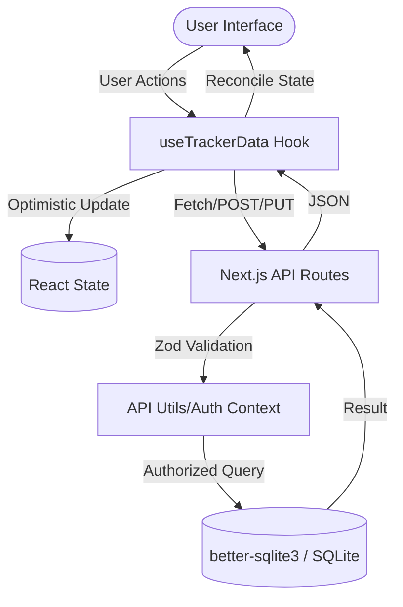

# MindfulTrack: CBT & Mood Tracker

MindfulTrack is a comprehensive Cognitive Behavioral Therapy (CBT) and mood tracking application designed to help users identify thought patterns, manage emotions, and develop healthier cognitive habits.

## 🌟 Features

- **📊 Mood Check-in**: Quickly log your current mood (1-10) along with specific emotions and notes. Track your mood trends over time with interactive charts.
- **📓 CBT Journaling**: Step-by-step journaling process to identify automatic thoughts, recognize cognitive distortions, and develop rational reframes.
- **✏️ Entry Management**: Full support for editing your CBT journal entries even after they've been created.
- **📈 Dynamic Insights**: Visualize your mental health progress. Understand your most frequent cognitive distortions, emotion triggers, and behavioral patterns.
- **📚 CBT Guide**: A comprehensive educational resource explaining common cognitive distortions (like All-or-Nothing Thinking, Overgeneralization, etc.) with examples and reframing techniques.
- **📜 History Synthesis**: A structured history view that provides objective summaries of your entries and suggests actionable steps based on your personal patterns.
- **🌓 Dark Mode Support**: Fully responsive UI with high-contrast support for both light and dark modes.

## 🛠️ Tech Stack

- **Framework**: [Next.js 15+](https://nextjs.org/) (App Router)
- **Database**: [SQLite](https://sqlite.org/) via `better-sqlite3`
- **Styling**: [Tailwind CSS 4](https://tailwindcss.com/)
- **Charts**: [Recharts](https://recharts.org/)
- **Icons**: [Lucide React](https://lucide.dev/)
- **Testing**: [Vitest](https://vitest.dev/) & [React Testing Library](https://testing-library.com/docs/react-testing-library/intro/)

## 🏗️ System Architecture

### 🛡️ Core Technology Stack
- **Frontend**: [Next.js 15](https://nextjs.org/) (App Router, React 19)
- **State Management**: React Hooks (useState, useMemo, useEffect) & Custom Hooks (`useTrackerData`) for optimistic UI updates.
- **Styling**: [Tailwind CSS 4](https://tailwindcss.com/) with a **Neo-brutalist** design system.
- **Component Architecture**: Atomic design using `class-variance-authority` (CVA) for UI primitives (`Button`, `Card`, `Input`, `Badge`).
- **Backend**: Next.js Route Handlers (Server-side logic).
- **Database**: [SQLite](https://sqlite.org/) via `better-sqlite3` for local persistence.
- **Authentication**: [NextAuth.js](https://next-auth.js.org/) with session-based RBAC (Role-Based Access Control).
- **Validation**: [Zod](https://zod.dev/) for type-safe API requests and responses.

### 📂 Module Breakdown
- `src/app/`: Next.js App Router (Pages, Layouts, API Routes).
- `src/components/ui/`: Atomic UI primitives (Stateless, highly reusable).
- `src/components/`: Domain-specific components (Form handlers, views, charts).
- `src/hooks/`: Custom React hooks for data orchestration and lifecycle management.
- `src/lib/`: Shared utilities, database initialization, and authentication configuration.
- `src/types/`: Centralized TypeScript definitions and Zod schemas.
- `db/`: Database migrations (Sqitch), schema definitions, and seed data.

### 🔄 Data Flow


### 📡 API Design Principles
- **RESTful Conventions**: Clean endpoint structure (`/api/mood`, `/api/cbt`).
- **Type Safety**: End-to-end type safety using shared Zod schemas between client and server.
- **Standardized Responses**: Unified success/error response formats via `api-utils.ts`.
- **Middleware Security**: NextAuth middleware protects all routes except login and static assets.

### 🧪 Testing Methodologies
- **Unit/Integration**: [Vitest](https://vitest.dev/) and [React Testing Library](https://testing-library.com/) for component logic and hook behavior.
- **End-to-End (E2E)**: [Selenium WebDriver](https://www.selenium.dev/) for critical user flows (Login, Entry creation).
- **Accessibility**: [Axe-core](https://www.deque.com/axe/) integration in E2E tests to ensure WCAG 2.1 compliance.
- **Access Control**: Dedicated test suite for RBAC validation in API routes.

### 🔒 Security Considerations
- **RBAC**: Environment-toggled Role-Based Access Control (`ENABLE_RBAC`).
- **Input Sanitization**: Pervasive use of Zod to prevent injection and malformed data.
- **Secret Management**: Secure environment variable handling for `NEXTAUTH_SECRET` and DB paths.
- **CSRF Protection**: Native NextAuth CSRF protection for all mutating requests.

### 📈 Scalability & Performance
- **Dynamic Imports**: Strategic use of `next/dynamic` for heavy visual components (Charts, Insights) to minimize initial bundle size.
- **Tailwind 4 Optimization**: Use of CSS variables and design tokens in `@theme` for high-performance style injection.
- **Modular UI**: Decoupled component architecture allows for easy extraction into a standalone library if needed.
- **Database Portability**: `better-sqlite3` implementation is abstracted, allowing for future migration to PostgreSQL or PlanetScale if horizontal scaling is required.

### 🔌 Third-Party Integrations
- **Lucide React**: Unified icon system.
- **Recharts**: Responsive SVG-based data visualization.
- **Date-fns**: Robust date manipulation and formatting.
- **Next-Auth**: Pluggable authentication providers.

## 🚀 Getting Started

### Prerequisites

- Node.js 20.x or later
- npm (or yarn/pnpm/bun)

### Installation

1. **Clone the repository**:
   ```bash
   git clone <repository-url>
   cd mood-tracker
   ```

2. **Install dependencies**:
   ```bash
   npm install
   ```

3. **Run the development server**:
   ```bash
   npm run dev
   ```

4. **Open the app**:
   Navigate to [http://localhost:3000](http://localhost:3000) in your browser.

### Building for Production

```bash
npm run build
npm start
```

## 📖 Usage Examples

### Logging a Mood
1. Navigate to the **Mood** tab.
2. Select your rating from 1 to 10.
3. Select any emotions you're currently feeling.
4. (Optional) Tag a **Trigger** (e.g., "Work") and a **Behavior** (e.g., "Exercise").
5. Click **Log Mood**.

### Using the CBT Journal
1. Navigate to the **Journal** tab.
2. Follow the 5-step process:
   - **Step 1**: Describe the situation and your initial mood.
   - **Step 2**: Write down your automatic thoughts.
   - **Step 3**: Identify which cognitive distortions match your thoughts.
   - **Step 4**: Provide a rational response to reframe the situation and rate your mood again.
   - **Step 5**: Note any behavioral links or planned actions.
3. Click **Complete Entry**.

### Viewing Insights
Navigate to the **Insights** tab to see your progress metrics, including your most common distortions and how much relief (mood improvement) you typically gain from the journaling process.

## 🗄️ Database Management

This project uses [Sqitch](https://sqitch.org/) for database schema management and migrations. This ensures data integrity and provides a clear audit trail of schema changes.

### Prerequisites

You must have Sqitch and the appropriate database drivers installed on your system.

### Common Commands

All Sqitch commands should be run from the `db/` directory:
```bash
cd db
```

- **Deploy changes**: Apply pending migrations to your local database.
  ```bash
  sqitch deploy local
  ```
- **Revert changes**: Undo the last applied migration.
  ```bash
  sqitch revert local
  ```
- **Verify changes**: Run verification scripts to ensure the database matches the plan.
  ```bash
  sqitch verify local
  ```

The migration plan is stored in `db/sqitch.plan`, and SQL scripts are located in the `db/deploy/`, `db/revert/`, and `db/verify/` directories. The migration registry is stored in `db/registry`.

### Environment Configuration

The application uses the `DATABASE_PATH` environment variable to locate the SQLite database.
- **Local**: `data/mood-tracker.db`
- **Development**: `data/mood-tracker-dev.db`

Ensure you have a `.env.local` file with the correct path:
```text
DATABASE_PATH=data/mood-tracker.db
```

## 🧪 Testing

Run the test suite using Vitest:

```bash
npm test
```

## 📄 License

This project is private and intended for personal/educational use.

## 🚀 Deployment

### Deploy on Vercel

The easiest way to deploy your Next.js app is to use the [Vercel Platform](https://vercel.com/new?utm_medium=default-template&filter=next.js&utm_source=create-next-app&utm_campaign=create-next-app-readme) from the creators of Next.js.

Check out our [Next.js deployment documentation](https://nextjs.org/docs/app/building-your-application/deploying) for more details.